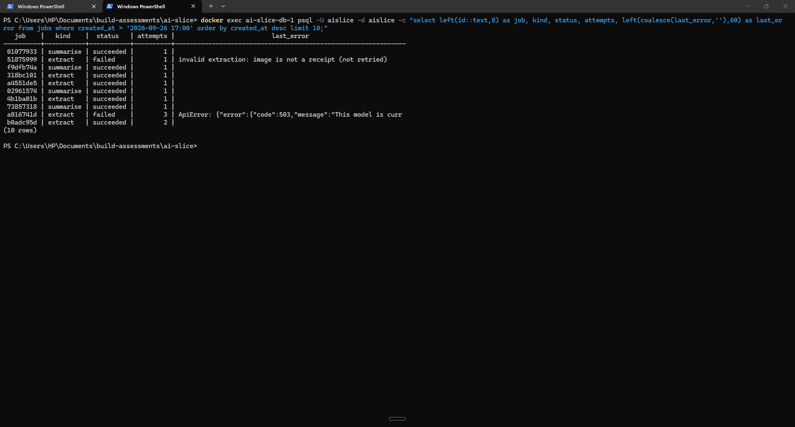
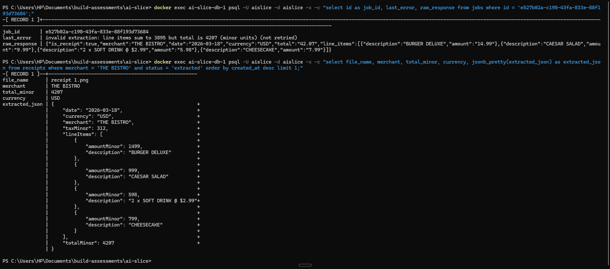
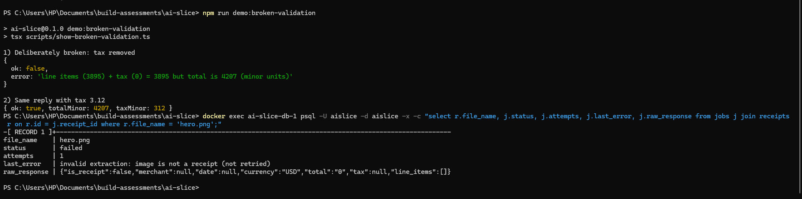
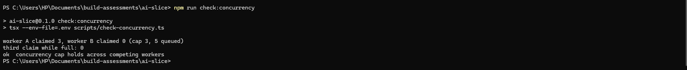
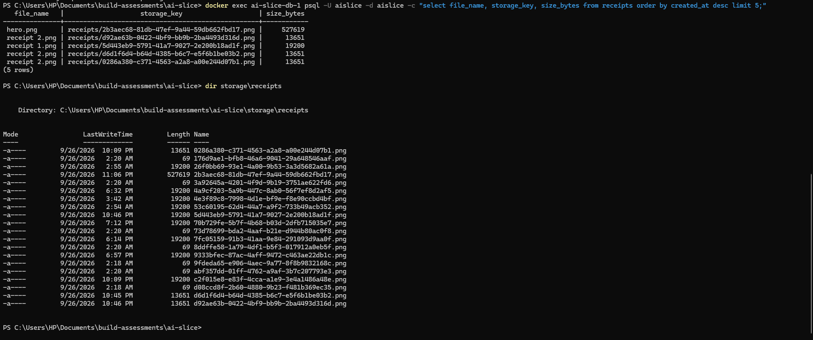

# AI Slice: receipts to expense summary

A receipts-to-expense-summary pipeline using two AI providers (Gemini for extraction, DeepSeek for categorisation), built and documented end to end.

## 1. What This Is

You sign in, upload one or more photos of receipts, and a few seconds later you get a summary of what you spent, grouped into categories (Food, Transport, Utilities, Office, Entertainment, Other). Two AI models do two different jobs. Gemini (`gemini-3.8-flash`) looks at each image and reads off the merchant, date, currency, line items, tax and total as structured JSON. DeepSeek (`deepseek-flash`) then gets that extracted data, never the images, and picks a category for each receipt with a one-sentence reason, plus a short overview of the whole upload. The app checks every model reply itself before using it, including that the line items plus tax actually add up to the total, and it does all the money arithmetic in its own code, so a model can misread a number but it can never miscalculate a total. Anything that fails is shown as failed, not hidden: an unreadable receipt is marked and left out of the totals, and if categorisation is unavailable the batch still finishes with every receipt under "Other" and a note saying why.

I deliberately left several things out because the brief didn't ask for them: sign-up, email verification and password reset (sign-in is a trimmed copy of auth-slice's, with seeded test accounts), exporting or emailing a report, a combined view of spending across uploads, editing a category or an extracted figure by hand, deleting uploads, and converting between currencies. Receipts in different currencies are handled correctly (each keeps its own currency and they are never added together), but there's no single combined total across currencies. Section 7 lists the rest of what this doesn't do, and why.

## 2. How To Run It

You need Node.js, Docker, a Gemini API key and a DeepSeek API key with some credit on the account.

1. Clone the repo and install dependencies with `npm install`. This also generates the Prisma client (the `postinstall` script runs `prisma generate`).
2. Copy `.env.example` to `.env` and fill in the four values by hand:
   - `DATABASE_URL`: the Postgres database from `docker-compose.yml`. The value already in `.env.example` works as-is.
   - `APP_URL`: `http://localhost:3003`. The app compares incoming requests' `Origin` header against this.
   - `GEMINI_API_KEY`: from Google AI Studio (aistudio.google.com → Get API key). Create it in a project with no billing account attached if you want to stay on the free tier.
   - `DEEPSEEK_API_KEY`: from platform.deepseek.com → API keys. DeepSeek has no free tier, so the account needs a small positive balance.

   I entered the keys myself. The coding agent that helped build this never created, opened or printed `.env`; its diagnostic scripts did load it into memory once, to make test calls while debugging the extraction schema, but the keys never appeared in any output, commit or log. The app reads the file at startup.
3. Start the database: `docker compose up -d`. Postgres 18 runs on port 5435, so it doesn't collide with auth-slice (5433) or payment-slice (5434).
4. Create the tables: `npx prisma migrate deploy`.
5. Create the test accounts: `npm run db:seed`. This adds alice, bob and carol (`@example.com`), all with the password `ai-slice-test-1`.
6. Start the app: `npm run dev`.
7. Open http://localhost:3003, sign in as `alice@example.com` / `ai-slice-test-1`, and upload a receipt image (JPEG, PNG or WebP, up to 5 files of 5 MB each).

Useful extras:
- `npm run db:studio` opens Prisma Studio on port 5558. The `jobs` table's `last_error`, `attempt_errors` and `raw_response` columns show exactly what every model call did.
- `npm run check:validation` runs the validation checks (no database, no keys).
- `npm run demo:broken-validation` shows the validator rejecting a deliberately broken extraction (the evidence in Section 5).
- `npm run check:concurrency` and `npm run check:attempt-errors` test the job queue against the real database. Stop the dev server first, or its worker will grab the test jobs.

Two things to know before you test. Gemini's free tier allows only 20 requests per day for this model, reset at midnight Pacific time; one receipt normally uses one request, up to three if it has to retry. And if the DeepSeek account has no balance, categorisation fails with a 402 and every receipt lands under "Other".

## 3. The Flow, Step By Step

Here's what happens from the moment you open the app to the moment you see your summary, with the file that does each part.

**Signing in.** `/dashboard` and `/batches/*` are gated by `src/proxy.ts`, which sends anyone without a session cookie to `/sign-in`. The form (`src/app/(auth)/sign-in/SignInForm.tsx`) posts to `POST /api/auth/signin` (`src/app/api/auth/signin/route.ts`), which checks the password and creates a session through `src/lib/auth/session.ts`. The cookie holds a random token; the database only stores its SHA-256 hash, and the session lasts seven days. The proxy only checks that a cookie exists; every protected page and route then looks the session up for real with `validateSession()`.

**Choosing files.** The dashboard (`src/app/dashboard/page.tsx`) shows the upload form (`src/app/dashboard/UploadForm.tsx`) and your ten most recent uploads. Before sending anything, the form runs `checkUploadFiles()` from `src/lib/validation/upload.ts`, the same function the server uses, so you get instant feedback on file count, size and type.

**Uploading.** The files go to `POST /api/receipts` (`src/app/api/receipts/route.ts`). In order, it:
1. rejects cross-site requests with `assertSameOrigin()` (`src/lib/security/origin.ts`), on top of the `SameSite=Lax` cookie;
2. requires a signed-in user;
3. applies the per-user rate limit with `consume()` (`src/lib/security/rate-limit.ts`): 10 uploads per 10 minutes, answering 429 with a `Retry-After` header when exceeded;
4. re-runs `checkUploadFiles()`, then reads each file's first bytes with `detectImageType()` to confirm it really is a JPEG, PNG or WebP (an HTML file renamed to `.png` is rejected);
5. saves each image with `putObject()` in `src/lib/storage.ts` under a server-generated key like `receipts/<uuid>.png`;
6. in one database transaction, creates a batch, one receipt row per file and one `extract` job per receipt;
7. answers `202` with the batch id straight away. No AI call has happened yet.

The browser then moves to `/batches/<id>`.

**The worker picks up the jobs.** When the server starts, `src/instrumentation.ts` calls `startWorker()` in `src/lib/jobs/worker.ts`. Every two seconds it calls `claimJobs()` in `src/lib/jobs/queue.ts` for each job kind. That function counts how many jobs of that kind are already running and claims only enough to stay under the cap (3 extractions, 1 summary), using `FOR UPDATE SKIP LOCKED` so two workers can never take the same job. Claiming a job marks it `running`, adds one to `attempts` and gives it a two-minute lease (`locked_until`).

**Extraction.** `runExtract()` in `src/lib/jobs/handlers.ts` reads the image back with `getObject()` and sends it to Gemini through `extractReceiptText()` (`src/lib/ai/gemini.ts`), with a 45-second timeout. Gemini's reply is checked by `parseExtraction()` (`src/lib/validation/extraction.ts`): the JSON shape, that each amount is a plain decimal, that the currency is a real ISO code, that it's actually a receipt, and that line items plus tax equal the total within 2%. Amounts are converted to integer minor units (cents) by `toMinorUnits()` in `src/lib/money.ts`.

**Recording the result.** The outcome is written in one transaction through `fencedFinish()`, which only succeeds if this worker still owns the job (see Section 5). If extraction worked, the receipt is marked `extracted` with its merchant, date, total and currency. If it failed, `failureUpdate()` asks `isRetryableProviderError()` (`src/lib/ai/errors.ts`) whether it's worth another go: a 429, a 503 or a timeout goes back in the queue with a growing delay (5 s, then 10 s), anything else fails immediately. Every failed attempt is appended to `attempt_errors`, and if the model replied but the reply failed validation, that reply is saved in `raw_response`. After the last attempt, the receipt is marked `failed`.

**Queuing the summary.** Each time a receipt finishes, for better or worse, `queueSummaryIfReady()` checks whether any receipt in the batch is still pending. Once none are, it queues exactly one `summarise` job; a unique `dedupe_key` makes a second attempt to queue it a no-op.

**Categorisation.** `runSummarise()` gathers the extracted receipts and sends them, as JSON text only, to DeepSeek through `summariseText()` (`src/lib/ai/deepseek.ts`), with a 30-second timeout. `parseModelSummary()` (`src/lib/validation/summary.ts`) checks that every receipt was categorised exactly once and only with one of the six categories. Then `buildSummary()` adds up the totals per category and currency in code; DeepSeek is never asked for a number. The summary is saved and the batch is marked `done`. If DeepSeek fails for good, the batch still finishes with a fallback summary built in code (every readable receipt under "Other", exact totals), and if no receipt could be read at all, no model call is made.

**Showing the result.** `/batches/[id]` (`src/app/batches/[id]/page.tsx`) renders the batch on the server through `getBatchView()` in `src/lib/batches.ts`, which only finds batches belonging to the signed-in user, so someone else's batch id gives a 404. `src/app/batches/[id]/BatchStatus.tsx` then polls `GET /api/batches/[id]` (`src/app/api/batches/[id]/route.ts`) every two seconds until the batch is done, showing each receipt's status, the category totals and any unreadable receipts, which are marked and left out of the totals.

**If the server dies mid-job.** Nothing is lost, because all the state lives in the `jobs` table. When the server comes back, any job whose lease has expired is claimable again, and that lost attempt is recorded as "lease expired". If it was already the last attempt, `applyAbandonedFallback()` applies the same fallback a normal final failure would.

## 4. The Data Model

The schema is in `prisma/schema.prisma`; the constraints Prisma can't express are hand-written at the bottom of `prisma/migrations/20260926011303_init/migration.sql`.

| Table | What it holds |
|---|---|
| `users` | Test accounts: email, display name, password hash. Copied from auth-slice. |
| `sessions` | One row per signed-in session: the SHA-256 of the cookie token and its expiry. |
| `rate_limit_attempts` | One row per allowed upload inside the current rate-limit window. |
| `batches` | One per upload: whose it is and how far along it is. |
| `receipts` | One per uploaded image: where the file is stored, and the validated figures once extracted. |
| `jobs` | The work queue: one `extract` job per receipt and one `summarise` job per batch, with their attempts and errors. |
| `summaries` | The finished summary for a batch, and whether a model or the fallback produced it. |


*The `jobs` table after real runs: a succeeded extraction next to failed ones, with their attempt counts and `last_error`.*

### Columns that were decisions

- **IDs are UUIDs generated by Postgres** (`gen_random_uuid()`), so a row is valid even if something other than Prisma inserts it, and batch ids in URLs can't be guessed by counting up.
- **Every timestamp is `timestamptz`**, so it's an exact moment rather than a local clock time that depends on the server's timezone.
- **Status columns are `text` with a CHECK constraint, not Postgres enums.** `batches.status`, `receipts.status`, `jobs.status`, `jobs.kind` and `summaries.source` each only accept a fixed list of values, which is the part that matters. I chose CHECK over an enum because changing a CHECK is one `ALTER TABLE`, while adding or removing an enum value is awkward in Postgres, and I expected the lists to change while building. (The batch statuses did change between planning and building: the plan had a `failed` batch status that I dropped once every failure path had a fallback.)
- **Money is an integer in minor units, always next to its currency.** `receipts.total_minor` is an `integer` (4207 means $42.07) and `receipts.currency` is a three-letter code. Floats can't represent cents exactly, and an amount without its currency is meaningless, so the database refuses one without the other.
- **The extracted fields on `receipts` are nullable** (`merchant`, `receipt_date`, `total_minor`, `currency`, `extracted_json`) because a receipt row exists from the moment it's uploaded, before anything has been read. The constraints below tie "has a total" to "status is extracted", so nullable doesn't mean anything goes.
- **`receipts.storage_key` is text, not the file.** The image lives in storage; the row only says where. It's unique, so two receipts can never point at the same file.
- **`receipts.extracted_json` is `jsonb`** holding the full validated extraction (line items, tax). I kept the line items as JSON rather than a separate table because nothing queries individual line items; the summary only needs them as a list.
- **`jobs.attempts` and `jobs.max_attempts`** are integers the database keeps in order (attempts never below 0 or above the maximum), so a job can't retry forever.
- **`jobs.locked_until`** is the lease. It's only set while a job is running, which is how a crashed worker's job gets noticed and picked up again.
- **`jobs.dedupe_key`** is nullable and unique. Only `summarise` jobs set it (`summarise:<batch id>`), so the last two receipts finishing at the same moment can't create two summaries. Postgres allows many nulls in a unique column, so extract jobs are unaffected.
- **`jobs.last_error`, `jobs.attempt_errors`, `jobs.raw_response`**: the latest error as text, every attempt's error as a JSON list that's never cleared, and the model's raw reply when it arrived but failed validation. These three columns are how every problem in Section 6 was diagnosed.
- **`summaries.batch_id` is the primary key**, not a separate id, which makes "one summary per batch" a rule of the table itself.
- **`summaries.summary_json` is `jsonb`**: the category totals, each receipt's category and reason, the overview and the ids of receipts left out.

### Invalid states the database refuses

Even if application code had a bug, Postgres would reject these:

- **A job that belongs to nothing, or a receipt without a batch.** Every `batch_id`, `receipt_id` and `user_id` is a foreign key, with `ON DELETE CASCADE` so deleting a batch removes its receipts, jobs and summary together instead of leaving orphans.
- **Two summaries for one batch.** `summaries.batch_id` is the primary key, and `jobs.dedupe_key` is unique.
- **Two receipts sharing a file, or two users with one email.** `storage_key` and `email` are unique; `users_email_lowercase_trimmed` also stops "A@x.com" and "a@x.com" becoming two accounts.
- **A made-up status or job kind.** `batches_status_valid`, `receipts_status_valid`, `jobs_status_valid`, `jobs_kind_valid`, `summaries_source_valid`.
- **An amount without a currency, or a negative total.** `receipts_amount_has_currency`, `receipts_total_non_negative`, `receipts_currency_iso` (three capital letters).
- **An "extracted" receipt with no total, or a pending one with a total.** `receipts_extracted_has_amount`.
- **An extract job without a receipt, or a summarise job with one.** `jobs_extract_has_receipt`.
- **A running job without a lease, or a finished job still holding one.** `jobs_running_has_lease`.
- **A job past its attempt limit.** `jobs_attempts_bounded`, `jobs_max_attempts_positive`.
- **A model summary that doesn't say which model, or a fallback that claims one.** `summaries_model_id_matches_source`.
- **An empty file record.** `receipts_size_positive`.
- **A blank or oversized display name.** `users_name_length` (1 to 80 characters).

## 5. The Concepts

### API endpoints

**What it is.** An endpoint is a URL plus an HTTP method that does one specific thing, like `POST /api/receipts` meaning "take these files and start processing them". This app both offers endpoints (to its own pages) and calls them (Gemini's and DeepSeek's).

**Why it's needed.** Without a clear endpoint for each action, the browser would have no defined way to hand files to the server or ask how a batch is doing, and there'd be no single place to put the checks (sign-in, rate limit, file type) that every upload must pass.

**How I implemented it.** Four route handlers under `src/app/api/`: `POST /api/receipts` (upload, answers 202 with a batch id), `GET /api/batches/[id]` (status and results, owner only), and `POST /api/auth/signin` and `/signout`. They all return the same shapes, built in `src/lib/http.ts`: a JSON body on success, and `{ error: { code, message } }` on failure with a status that means something (400 invalid input, 401 not signed in, 403 wrong origin, 404 not found or not yours, 429 rate limited).

**What I chose against, and why.** Next.js server actions instead of route handlers: they'd work for the upload form, but the batch page needs to poll for status, and I wanted one consistent HTTP surface I could test with curl. I also chose to answer the upload with 202 and a batch id rather than hold the request open until the AI finished; the jobs and workers part below explains why.

### SDKs vs raw HTTP

**What it is.** A provider's SDK is their official library that wraps their HTTP API: it builds the requests, handles authentication and gives you typed responses and typed errors. Raw HTTP means writing `fetch` calls against their URLs yourself.

**Why it's needed.** Hand-written requests fail in quiet ways: a misspelled field is ignored rather than rejected, and every error comes back as a generic response you have to interpret yourself. With an SDK, a wrong request shape fails when TypeScript compiles it, and errors arrive as classes with a `status` I can check.

**How I implemented it.** Gemini uses Google's `@google/genai` (`src/lib/ai/gemini.ts`). DeepSeek's API is compatible with OpenAI's, so I use the official `openai` package pointed at DeepSeek's URL (`src/lib/ai/deepseek.ts`):

```ts
new OpenAI({ apiKey, baseURL: aiConfig.summary.baseURL, timeout: aiConfig.summary.timeoutMs, maxRetries: 0 })
```

I turned the SDK's own retries off (`maxRetries: 0`) because retries belong to my job queue, where they're counted, delayed and logged. Retrying inside the SDK would silently stretch every timeout. The typed errors are what `isRetryableProviderError()` relies on.

**What I chose against, and why.** Raw `fetch` for both: fewer dependencies, but I'd be rebuilding error handling the SDKs already get right. And a single multi-provider library: one more layer between my code and each provider's actual behaviour, which mattered when I was debugging exact Gemini error codes.

### System prompts vs user prompts

**What it is.** The system prompt holds the standing instructions ("you read receipts, return this JSON, amounts look like 12.50"). The user prompt holds the thing to work on this time (this image, this batch of receipts).

**Why it's needed.** If the instructions and the data are mixed together, the data can override the instructions: a receipt with "ignore previous instructions" printed on it would be sitting in the same message as the rules. Keeping them apart also means the rules are written once and every call uses the same wording.

**How I implemented it.** For Gemini, the rules go in `systemInstruction` and the user turn is just "Extract this receipt." plus the image. For DeepSeek, the system message lists the exact JSON keys, the six allowed categories and the rules, and the user message is only the JSON array of extracted receipts. The rules include things I learned the hard way, like "tax is tax + tip + service charge added together" and "line items are the purchased items only".

**What I chose against, and why.** One combined prompt with the instructions and data concatenated: simpler, but it's exactly the mixing described above. And sending the receipt images to DeepSeek as well: it doesn't need them to categorise, and sending less data is cheaper and exposes less.

### Model parameters

**What it is.** Settings sent with each call that change how the model answers: temperature (how much randomness), an output token cap (how long the answer may be) and, on my side, a timeout (how long I'll wait).

**Why it's needed.** Reading numbers off a receipt should give the same answer every time; with randomness turned up, the same receipt could come back with different totals. Without a token cap, a confused model can keep generating and I pay for all of it. Without a timeout, a hung call ties up a worker slot indefinitely.

**How I implemented it.** Every value lives in `src/config/ai.ts`; nothing is hardcoded in the handlers.

| | Gemini (extraction) | DeepSeek (categorisation) |
|---|---|---|
| Temperature | 0 | 0.2 |
| Max output tokens | 1,024 | 1,024 |
| Timeout | 45 s | 30 s |

Extraction gets 0 because it's transcription: there's one right answer. Categorisation gets a little room (0.2) because the reasons and overview are written text, and a bit of variation reads more naturally, while the category itself is still forced into a fixed list by validation. 1,024 tokens is plenty for one receipt's JSON or five receipts' categories. Extraction's timeout is longer because reading an image takes longer than reading text.

**What I chose against, and why.** Provider defaults: they're tuned for chat, not for transcription, and I'd have no control over cost or consistency. A Pro-tier model for categorisation: it's a choice from six categories over a few hundred tokens, and a Flash model does that fine at a fraction of the cost and latency.

### Structured output and schema validation

**What it is.** Structured output means asking the model to answer in a fixed JSON shape instead of prose. Schema validation means checking that answer in my own code before using it, because the model's promise to follow the shape isn't a guarantee.

**Why it's needed.** If I parsed prose, "Total: $42.07" today could be "the total comes to 42.07 dollars" tomorrow, and my parser breaks. Even with JSON, a model can return a wrong type, a missing field, a currency like "ZZZ", line items that don't add up, or a category that isn't on the list. Without validation, that goes straight into someone's totals.

**How I implemented it.** Each side gets both: a request for JSON, and a Zod check afterwards.
- Gemini gets `responseMimeType: "application/json"` with a JSON Schema describing only the shape: field names, types, which are required, and which can be null. Every rule about values lives in the Zod schema in `src/lib/validation/extraction.ts`. That split came from a real failure: Gemini refused my first, stricter schema outright (Section 6).
- DeepSeek gets `response_format: { type: "json_object" }`, which guarantees JSON but not a shape, so the exact keys are spelled out in its prompt and enforced by Zod in `src/lib/validation/summary.ts`.
- Beyond shape, `parseExtraction()` converts amounts to cents with the currency's own number of decimals, rejects unknown currencies, rejects "not a receipt", and checks line items plus tax against the total within 2%. `parseModelSummary()` rejects any receipt categorised twice, missed, invented, or given a category outside the six.

When validation fails, the error goes into `last_error` and `attempt_errors`, the model's actual reply goes into `raw_response`, and the job isn't retried (with the temperature this low, the same input gives the same answer). The receipt shows as unreadable, or the summary falls back to "Other".


*Top: Gemini's raw reply for the Bistro receipt, saved in `raw_response` after the old check rejected it (items only, 38.95, against a 42.07 total). Bottom: the validated result stored after the fix, with tax 3.12 as its own field.*


*`npm run demo:broken-validation` feeds Gemini's real Bistro reply through the real validator with the tax deliberately removed: rejected with "line items (3895) + tax (0) = 3895 but total is 4207". The same reply with tax 3.12 is accepted. Below it, the non-receipt image rejected in a real run with `is_receipt: false`.*

**What I chose against, and why.** Trusting the provider's JSON mode alone: it's a request, not a guarantee, and it says nothing about whether the numbers add up. Sending Gemini the full, strict schema so it enforces the rules itself: that's what I did first, and Gemini answered every call with 400 INVALID_ARGUMENT. Having the models return totals too: I'd then have to check their arithmetic; not asking for it at all removes the problem.

### Jobs and workers

**What it is.** A job is a database row describing one piece of work ("extract receipt X"). A worker is a loop that picks up jobs and does them, separately from the web request that created them.

**Why it's needed.** A Gemini call takes several seconds and sometimes fails. Doing it inside the upload request means the browser waits, a timeout loses the whole upload, a retry means re-uploading, and restarting the server mid-call loses the work entirely.

**How I implemented it.** The upload only creates rows and returns 202. The worker (`src/lib/jobs/worker.ts`) runs inside the Next.js server, started from `src/instrumentation.ts`. Every job has a status, an attempt count, a limit, a lease and its error history. Two details keep this correct:
- **Leases.** A claimed job gets `locked_until = now + 2 minutes`. If the worker dies, the lease runs out and the job becomes claimable again, so nothing waits forever.
- **Fencing.** `fencedFinish()` only writes a result if the job is still `running` with the attempt number this worker claimed. If a slow worker's lease expired and someone else took over, the slow worker's late result is thrown away instead of overwriting the newer one.

**What I chose against, and why.** Calling the model from the request handler: slow and fragile, as above. `after()` or a fire-and-forget promise: the work would vanish on restart, with no retry state. Redis with BullMQ: a solid queue, but a whole extra service to run for a few receipts at a time, when Postgres (already here) can do it with row locks.

### Queues, FIFO, and the concurrency cap

**What it is.** A queue hands out work in order; FIFO means first in, first out. The concurrency cap is the maximum number of jobs running at the same time.

**Why it's needed.** Without a cap, one upload of five receipts fires five Gemini calls at once, and ten users uploading together fire fifty. That's how you hit a provider's per-minute limit and get a wave of 429s, and how cost jumps without warning. Without an order, an old upload can wait behind newer ones indefinitely.

**How I implemented it.** `claimJobs()` in `src/lib/jobs/queue.ts` takes a per-kind lock inside Postgres, counts running jobs, and claims only enough to reach the cap: 3 extractions and 1 summary at a time (`jobs.concurrency` in `src/config/ai.ts`). Jobs are handed out oldest first (`ORDER BY run_after, created_at`); a job waiting on its retry delay sits out until the delay has passed. Because the count happens inside the database, the cap holds even with several worker processes:

```sql
SELECT id FROM jobs
WHERE kind = ${kind} AND attempts < max_attempts
  AND ((status = 'queued' AND run_after <= now()) OR (status = 'running' AND locked_until <= now()))
ORDER BY run_after, created_at
LIMIT ${slots}
FOR UPDATE SKIP LOCKED
```


*`npm run check:concurrency`: five jobs queued, two workers claiming at the same instant. Together they take exactly 3 (3 + 0), none twice, and a third claim while the cap is full gets 0.*

**What I chose against, and why.** A counter or semaphore in memory: it only knows about its own process, so two server instances would each allow 3. Strict FIFO with no delays: a job that just got a 503 would be retried instantly, while the provider is still overloaded.

### Rate limiting as cost control

**What it is.** A limit on how many times one user can do something in a time window. Here it's how many uploads, because each upload turns into paid model calls.

**Why it's needed.** Without it, one user (or one runaway script) can upload in a loop and burn through Gemini's 20 free requests for the day in a minute, locking everyone else out, or run up the DeepSeek bill. The concurrency cap slows spending down, but it doesn't limit the total.

**How I implemented it.** `consume()` in `src/lib/security/rate-limit.ts`, reused from payment-slice: an exact sliding window stored in `rate_limit_attempts`, with a per-key lock in Postgres so two simultaneous uploads can't both squeeze through. The upload route calls it before reading a single byte:

```ts
const limit = await consume(`upload:user:${auth.user.id}`, aiConfig.upload.rateLimit);
if (!limit.allowed) return rateLimitResponse(limit.retryAfterSeconds);
```

The limit is 10 uploads per 10 minutes per user, and a blocked request gets 429 with `Retry-After`, which the upload form shows as "try again in N seconds". Combined with at most 5 files per upload, that bounds what one user can queue. It fails closed: if the database can't be reached, the upload is refused, not waved through.

**What I chose against, and why.** A limit per IP address: users behind one office network would share a limit, and one person can switch IPs. A fixed window (a counter that resets on the minute): it lets through double the limit around the reset. A limit held in memory: resets on restart and isn't shared between processes.

### Why files live in storage, not the database

**What it is.** The uploaded image is written to a storage area (a local `storage/` folder here, standing in for something like S3), and the database only keeps its key, `receipts/<uuid>.png`.

**Why it's needed.** Images in database rows make every backup, every query that touches the table and every copy of the data carry megabytes of binary, and the database becomes the most expensive place to keep files. Keeping only a key keeps rows small, and moving files to S3 later means changing one module, not the data.

**How I implemented it.** `src/lib/storage.ts` is the only code that touches files. Keys are generated by the server (a random UUID plus the extension of the type detected from the bytes), never taken from the file's name, and `resolveKey()` refuses any path that would land outside the storage folder. Files are written before the database rows, so a row can never point at a file that doesn't exist; if the database insert fails, the worst case is an unreferenced file. The storage folder isn't served by the web server, so an upload can't be fetched by URL.


*`receipts` rows hold `storage_key` and `size_bytes`, no image data; the files themselves are in `storage/receipts/`.*

**What I chose against, and why.** Storing the bytes in a `bytea` column: simple, but everything above. S3 or R2 right now: it needs credentials and a bucket for a local assessment, and the brief allowed a documented local equivalent. Using the uploaded filename as the key: it can collide, and it's user input that ends up in a file path.

### The cost model

**What it is.** What one run costs, and what stops the total from growing without bound.

**Why it's needed.** Every upload spends real money or scarce free quota. Without knowing the per-run cost and having a ceiling, a bug, a retry loop or a busy day turns into an unexpected bill, or into a free quota that's gone by mid-morning.

**How I implemented it.** One upload of N readable receipts costs N Gemini calls and 1 DeepSeek call.
- **Gemini, extraction:** free on the free tier, capped at 20 requests per day per project for `gemini-3.8-flash`, reset at midnight Pacific time. If billing were attached, it's $0.75 per million input tokens and $3.75 per million output tokens, which I estimate at around half a cent per receipt at the upper end.
- **DeepSeek, categorisation:** `deepseek-flash` costs $0.30 per million input tokens and $1.20 per million output at peak ($0.15 and $0.60 off-peak). A batch sends roughly a few hundred to 2,000 tokens and gets back at most 1,024, so I estimate a categorisation call at about a tenth of a cent, and at most around a fifth of a cent. I haven't measured exact token counts; these are estimates from the limits.
- **What caps the total:** Gemini's 20-a-day quota is the hard ceiling, since nothing reaches DeepSeek unless it was extracted first. Below that: at most 5 files of 5 MB per upload, 10 uploads per 10 minutes per user, 3 attempts per job (and only for 429, 503 or timeouts), 1,024 output tokens per call, and 3 extractions plus 1 summary running at once. A batch where nothing could be read makes no DeepSeek call at all.

Putting the free model on extraction was deliberate: extraction runs once per receipt, categorisation once per batch, so the paid call happens once per upload however many receipts are in it.

**What I chose against, and why.** One provider for both jobs: every receipt would then cost a paid call, or both jobs would share the 20-a-day free limit. Paying for Gemini from the start: better for a real product, but for a demo the free tier costs nothing and its limit is known and documented. Retrying every error three times: I did that at first, and it spent three of the day's 20 requests on errors that could never succeed (Section 6).

## 6. What Went Wrong

These all happened with real Gemini and DeepSeek calls, and are recorded in more detail in `BUILD_LOG.md`. Alongside them, I ran these scenarios end to end: a single receipt (THE BISTRO, $42.07, categorised as Food), a second receipt ($241.50 of vehicle maintenance, categorised as Transport), both together in one batch (Food $42.07 and Transport $241.50, each with a reason), a non-receipt image (rejected, batch still finished), a DeepSeek account with no credit (402, fallback to "Other" with exact totals) and a Gemini demand spike (503s). The concurrency cap and per-attempt logging were checked with the scripts in Section 2, and the missing-key fallback by running the app from a copy with no `.env`.

### 1. Gemini refused every extraction request

**Symptom.** My first real upload of the Bistro receipt came back "couldn't be read". All three attempts failed with the same error, and a second upload did the same:
`ApiError: {"error":{"code":400,"message":"Request contains an invalid argument.","status":"INVALID_ARGUMENT"}}`

**Investigation.** The message doesn't say which argument, so I sent one-off requests that each changed one thing. A bad key would have come back as "API key invalid" or 403, and a quota problem as 429, so it wasn't either of those. The receipt image with no schema worked: Gemini read "THE BISTRO" correctly, which ruled out the key, the model name and the image. A text-only prompt with my full schema failed with the same 400, so the image wasn't the problem. Removing the `$schema` line: still 400. Replacing the long date regex with a simple date format: still 400, so it wasn't only the date rule. A minimal schema (`merchant` as a string) worked, and so did adding "string or null". I ran out of free quota (problem 2) before I could find the exact rule, and along the way a few probes got 503 "high demand", which were just noise.

**Cause.** Gemini's structured-output API rejects some of the JSON Schema keywords Zod generates from my validation schema (the patterns, length limits, the 100-item cap or the date format). It accepts plain structure: field names, types, required fields and "or null". I never pinned down which keyword.

**Fix.** I stopped sending my validation rules to Gemini. It now gets a hand-written schema with structure only, and every rule about values is still enforced by Zod once the reply arrives. A check in `scripts/check-validation.ts` fails if anyone adds a value rule back into the schema sent to Gemini. Every extraction since has been accepted.

### 2. The free quota was 20 a day, and my retries were spending it

**Symptom.** Halfway through debugging problem 1, requests started failing with 429 RESOURCE_EXHAUSTED.

**Investigation.** The first 429s came after I'd sent five probes within a few seconds, so I assumed a per-minute limit and spaced the requests out, which let a few more through. Then they came back for good, and the full error body named the quota: `GenerateRequestsPerDayPerProjectPerModel-FreeTier`, value 20, model `gemini-3.8-flash`. It was a daily limit; the "retry in 41s" in the message was misleading. I had earlier written that a handful of receipts was "far below any free quota", but I'd never actually seen this number, because Google only shows it inside AI Studio. Counting back, the two uploads had used 6 requests (3 attempts each, all failing with the 400 above) and my probes the rest.

**Cause.** Two things. I'd built on an assumption about the free tier that I hadn't checked. And the worker retried every failure three times, including a 400 that could never succeed, so each broken receipt cost three of the day's twenty requests.

**Fix.** I made retries selective: `isRetryableProviderError()` in `src/lib/ai/errors.ts` only retries 429, 503 and timeouts; anything else fails on the first attempt with "(not retried)" added to the error. `scripts/check-validation.ts` tests this with each SDK's real error classes. I also confirmed the reset time from Google's docs (midnight Pacific) rather than guessing, and documented the limit as a permanent constraint of this design (Section 7).

### 3. A correct extraction was rejected as "inconsistent"

**Symptom.** After the quota reset, the same Bistro receipt got through Gemini but was rejected by my own check: `invalid extraction: line items sum to 3895 but total is 4207 (minor units)`.

**Investigation.** I could see the two sums but not what Gemini had actually returned, because the reply was thrown away when validation failed. It could have been tax, a missed item or a misread total, and I couldn't tell which. So I added the `raw_response` column to save the reply whenever it fails validation, without changing the rule, and uploaded the same receipt again. The saved reply showed four line items (14.99 + 9.99 + 5.98 + 7.99 = 38.95), including "2 x SOFT DRINK @ $2.99" correctly doubled, and a total of 42.07. The gap was 3.12, and 38.95 × 8% = 3.116, which rounds to 3.12. Gemini had read the receipt perfectly.

**Cause.** My check was wrong, not the model. It compared the line items alone against a total that included tax, so any receipt with more than about 2% tax would fail.

**Fix.** I added a `tax` field (tax, tip and service charge combined, or null) to the extraction, told Gemini to keep those out of the line items, and changed the check to line items plus tax against the total. The next upload passed with tax 3.12, and Gemini's real reply is now a test case in `scripts/check-validation.ts`. Having the raw reply was what let me tell the check was wrong rather than guessing.

### 4. A demand spike beat the retries, and the earlier errors were lost

**Symptom.** In a two-receipt batch, receipt 2 failed after all three attempts with `503 ... "This model is currently experiencing high demand"`. Receipt 1 in the same batch succeeded, but on its second attempt.

**Investigation.** Retrying was the right call (503 is retryable), and the backoff did its job: 5 seconds, then 10. But all three attempts fit into about 30 seconds, and the spike lasted longer; the same receipt went through on a re-upload later. When I went to look at what had happened on the earlier attempts, it wasn't there: `last_error` only held the latest error, and a success cleared it, so receipt 1's first failure had left no trace at all. I could only say it was "probably a 503".

**Cause.** The job only kept one error, overwritten on every attempt.

**Fix.** I added `jobs.attempt_errors`, a JSON list with one entry per failed attempt (attempt number, time, error), appended in SQL and never cleared, including when a crashed worker's lease expires. `scripts/check-attempt-errors.ts` checks that a failure followed by a success keeps the failure, that a lost attempt is recorded in order, and that a worker that has lost its claim can't add anything. I deliberately didn't lengthen the backoff at the same time: a longer delay would ride out spikes but spend more of the daily quota, and I'd rather see the data first.

## 7. What This Slice Does Not Handle

**Outside the brief.** These were never asked for, so I didn't build them:
- Sign-up, email verification and password reset. Sign-in is a trimmed copy of auth-slice's, with seeded test accounts.
- Exporting or emailing a report (CSV, PDF, email).
- A combined view across uploads. The dashboard lists your ten most recent uploads, each with its own summary, but there's no weekly or monthly total.
- Correcting a category or an extracted figure by hand. DeepSeek's category is final, and a mixed receipt gets whichever category it judges closest.
- Deleting uploads or their images.
- Currency conversion. Totals are kept per currency and never added together, so there's no single grand total across currencies.

**What I'd add for real users, or ran out of time for:**
- **A paid Gemini tier.** The free tier's 20 extractions a day (fewer when retries happen) is fine for a demo, not for a product. Receipts rejected once the cap is hit aren't retried the next day; they have to be uploaded again. Free-tier images may also be used by Google to improve its products, so real receipts shouldn't go through this setup. Attaching billing removes the cap at roughly half a cent per receipt.
- **Cloud storage.** Files sit in a local folder, so they don't survive moving to another machine and there's no backup. The data model already only stores a key, so S3 would be a change to one module.
- **An automated test suite.** Correctness rests on real end-to-end runs plus three targeted check scripts, not unit and integration tests that run on every change.
- **Shared auth code.** Sign-in is copied from auth-slice, so a fix there has to be ported here by hand.
- **Knowing exactly which schema rule Gemini rejects.** The shape-only schema works, but if someone adds a value rule back, the same 400 could return without an obvious cause. The check script guards against the obvious cases.

## 8. If I Built This Again

The biggest thing I'd change is proving my assumptions about the providers with real calls on day one, before building anything on top of them. My two worst problems both came from things I'd assumed rather than tested: that Gemini would accept the strict JSON schema Zod generated, and that its free tier had room for a few receipts a day with retries to spare. I only found out about the 400 and the 20-a-day cap after the whole pipeline was built, and then had to debug both at once, with the investigation of one burning the quota I needed for the other. An hour at the start sending one real receipt through each provider, with the real schema, and deliberately triggering the errors I planned to handle (a bad request, a rate limit, a timeout) would have shown me the actual limits, error codes and schema rules up front. The retry policy, the schema split and the tax field would then have been designed in from the start instead of fixed after the fact.
